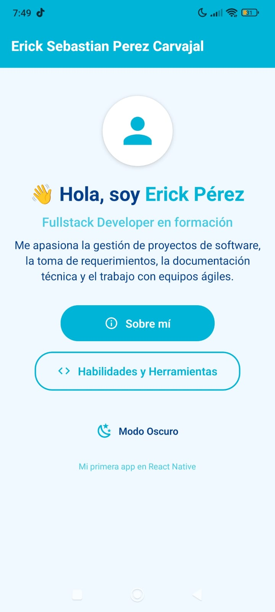
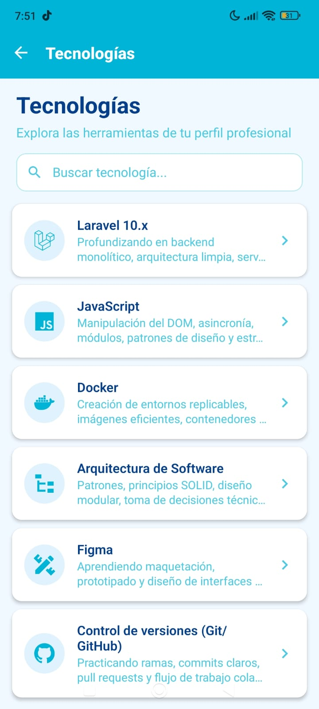
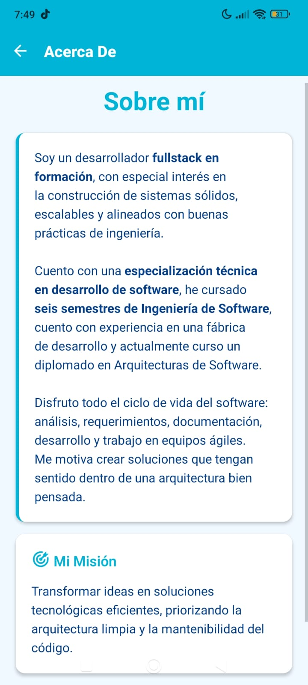

# Mi Primera App en React Native - Erick Pérez 🚀

## 👨‍💻 Perfil Profesional
**Erick Sebastian Pérez Carvajal**  
Fullstack Developer en formación | Ingeniería de Software  
*Apasionado por la gestión de proyectos, requerimientos técnicos y arquitecturas limpias.*

---

## 📱 Inspiración del Proyecto
Esta aplicación es el resultado del primer paso en el desarrollo móvil con **React Native**. El diseño está inspirado en una estética limpia, utilizando una paleta de colores basada en **Celeste** y **Azul Profundo**, optimizada para lectura tanto en modo claro como oscuro.

---

## 🛠️ Lo que estoy aprendiendo
Basado en mi camino actual de formación:

- **Laravel 10.x:** Backend monolítico, arquitectura limpia y servicios.
- **JavaScript:** Asincronía, patrones de diseño y estructuras complejas.
- **Docker:** Creación de entornos replicables y contenedores eficientes.
- **Arquitectura de Software:** Principios SOLID y diseño modular.
- **Figma:** Maquetación y prototipado de interfaces.
- **Git/GitHub:** Flujo de trabajo colaborativo real.

---

## 📸 Galería de Evidencias
Visualiza el resultado final de la aplicación en sus diferentes secciones:

| Pantalla de Inicio | Listado de Tecnologías | Acerca de la App |
| :---: | :---: | :---: |
|  |  |  |

---
---
## 🎨 Diseño Visual
- **Paleta de Colores:** Celeste (#00B4D8) y Amarillo (#FFD166).
- **Modo Oscuro:** Adaptación de contraste para entornos de baja luz.
- **Componentes:** Tarjetas con elevación, botones redondeados e iconografía moderna.

---

## 🚀 Instalación
```bash
# Clonar
git clone <url-del-repositorio>

# Instalar dependencias
npm install

# Iniciar proyecto
npx expo start
```

---
*© 2026 - Erick Pérez - Hola Mundo*

